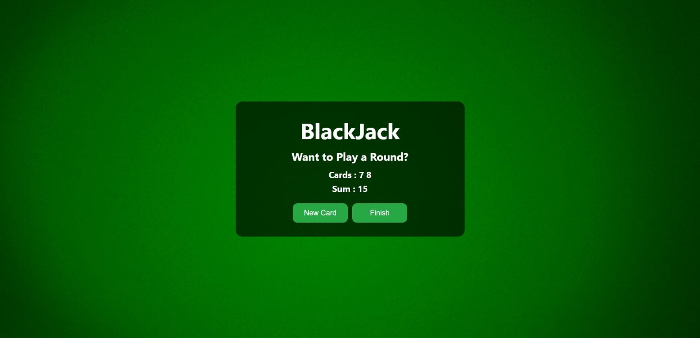
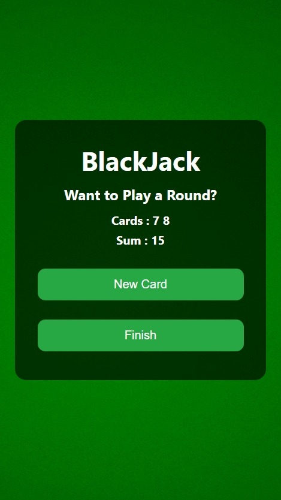

# BlackJack Game

A simple browser-based implementation of the classic BlackJack card game with a clean interface.




## Features

- Play rounds of BlackJack with virtual cards
- Simple game mechanics focused on hitting 21 without going over
- Dynamic button visibility based on game state
- Real-time sum calculation and game status updates
- Responsive design for both desktop and mobile play

## Game Rules

This simplified version of BlackJack follows these rules:

- Aim to get as close to 21 as possible without going over (bust)
- Cards 2-10 are worth their face value
- Face cards (Jack, Queen, King) are worth 10
- Aces are always worth 11 (simplified rule)
- Start with two random cards and choose to draw more or finish
- Going over 21 results in a bust (automatic loss)

## Technologies Used

- HTML5
- CSS3
- JavaScript (Vanilla)

## How to Play

1. Click "Start Game" to begin a new round
2. Two cards will be dealt automatically
3. Choose to:
   - Draw another card ("New Card" button)
   - Stop and see your final score ("Finish" button)
4. If you bust (go over 21), the game ends automatically
5. Click "Continue" to play another round

## Implementation Details

This application demonstrates:

- JavaScript random number generation
- Dynamic DOM manipulation
- Game state management
- Conditional logic for game rules
- Event handling with button clicks
- Dynamic UI element visibility control

## Project Structure

```
BlackJack/
├── index.html
├── index.css
└── assets/
    ├── desktop-view.png
    └── mobile-view.png
```

## Learning Objectives

This project explores:

- JavaScript random number generation
- Game state management
- Conditional logic
- DOM manipulation
- Event handling
- Dynamic UI updates

## Future Enhancements

Potential improvements for the game:

- Implement dealer mechanics
- Add betting functionality
- Support for multiple players
- Proper Ace handling (1 or 11)
- Card visuals/graphics
- Sound effects
