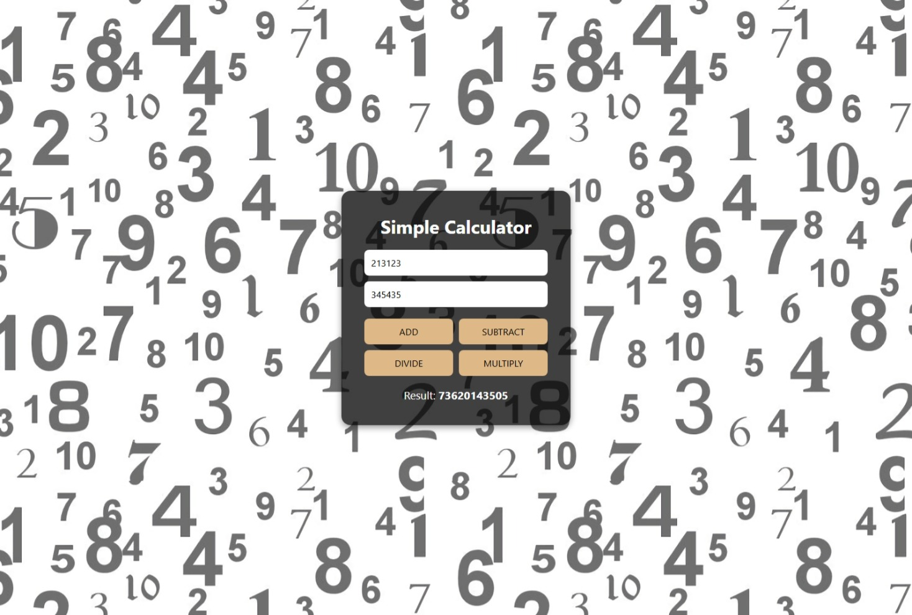
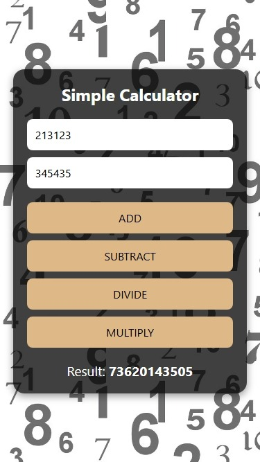

# Simple Calculator

A clean, user-friendly web calculator application that performs basic arithmetic operations.




## Features

- Perform addition, subtraction, multiplication, and division
- Input validation with error handling
- Responsive design for desktop and mobile use
- Clean, minimalist UI

## Technologies Used

- HTML5
- CSS3
- JavaScript (Vanilla)

## Usage

The calculator provides a straightforward interface:

1. Enter the first number in the top input field
2. Enter the second number in the bottom input field
3. Click one of the operation buttons:
   - ADD: Performs addition (num1 + num2)
   - SUBTRACT: Performs subtraction (num1 - num2)
   - DIVIDE: Performs division (num1 / num2)
   - MULTIPLY: Performs multiplication (num1 \* num2)
4. View the result displayed at the bottom

The calculator includes error handling for:

- Invalid inputs (non-numeric values)
- Division by zero

## Implementation Details

This application demonstrates:

- DOM manipulation with vanilla JavaScript
- Event handling with onclick events
- Input validation and error handling
- Basic arithmetic operations
- Conditional logic with switch statements

## Project Structure

```
Simple Calculator/
├── index.html
├── index.css
└── assets/
    ├── desktop-view.png
    └── mobile-view.png
```

## Learning Objectives

This project explores:

- Form input handling
- Number parsing and validation
- Basic JavaScript operations
- User feedback and error display
- Responsive web design
